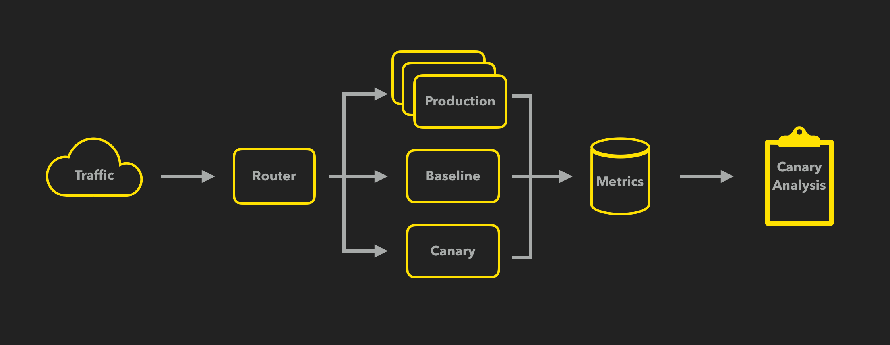
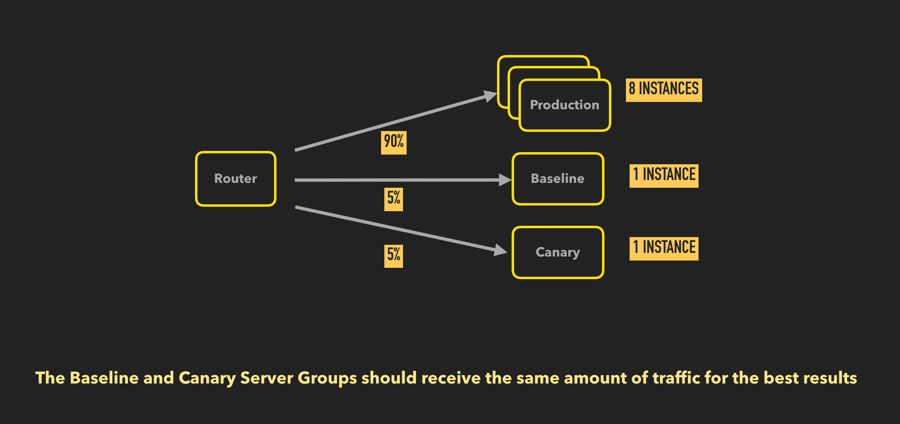
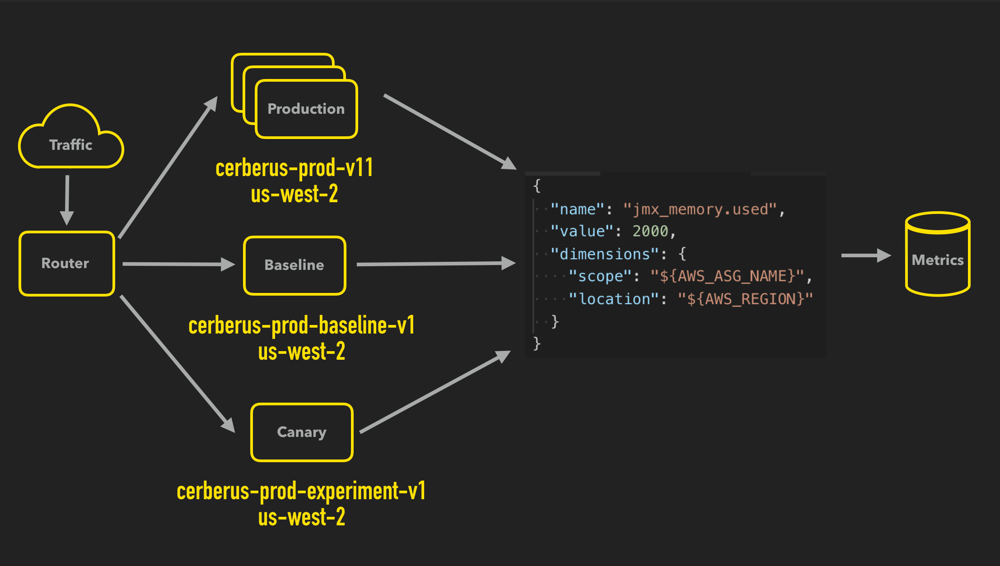

# Instrumenting Application Metrics For Kayenta

The purpose of this doc is to describe how applications have to be configured for their metrics to be usable by Kayenta.

## Define what makes your application healthy then measure and report it

Metrics are a crucial part of canary analysis, they are the indicators of the health of your system that are sent as input to the judge to decide the health of the canary.

Go read the following from the [Spinnaker Canary Best Practices](https://www.spinnaker.io/guides/user/canary/best-practices/#carefully-choose-the-metrics-to-analyze)

## Make sure to report your metrics in a way that Kayenta can use

Now that you have [defined what makes your app healthy](#define-what-makes-your-application-healthy-then-measure-and-report-it) you need to make sure it's being reported in a way that Kayenta can query it.

Kayenta must be able to query the control, experiment and current production [server groups] separately.

Here is a high-level overview of the canary process:

You detect the current productions [server group] and deploy it in a new [server group] as the baseline.
You simultaneously deploy the new change as the canary [server group].

You now have current prod, the baseline, and the canary all running and receiving production traffic.
The baseline and experiment should be receiving the same amount of traffic as each other so that metrics such as counts don't have to be converted to rates (How would you convert CPU usage to a rate?).

It isn't enough to simply have a different [server groups] they must be reporting their metrics with dimensional metadata about themselves to include a unique id that distinguishes the [server groups] apart from each other and their location.

So when you configure your application's metrics reporting you will need to configure them to globally send location and a unique identifier for the [server groups] aka the scope.

Once you have done this, that scope and location metadata can be used to interact with Kayenta's APIs to perform canary analysis.

[server groups]: https://www.spinnaker.io/concepts/#server-group
[server group]: https://www.spinnaker.io/concepts/#server-group
